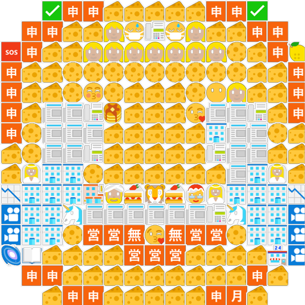

# Emoji Picture
Turns the pixels of an image into emojis, by matching the average emoji color (in LAB color space) to the pixel color. The color comparison is done with delta E* color comparison https://www.wikiwand.com/en/Color_difference#/CIELAB_%CE%94E*. 

## Example
Every pixel is an emoji, the emojis that the algorithm can pick from can be predefined by the user.
### Emojified picture

### Original picture


## Project setup
```
npm install
```

### Customize configuration
See [Configuration Reference](https://cli.vuejs.org/config/).
